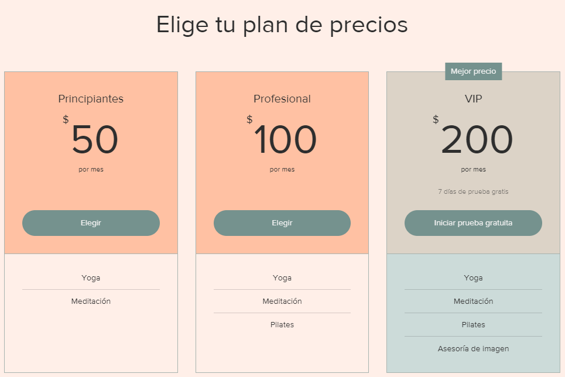

<!DOCTYPE html>
<html lang="en">
<head>
    <meta charset="UTF-8">
    <meta name="viewport" content="width=device-width, user-scalable=no, initial-scale=1.0, minimum-scale=1.0">
    <link rel="stylesheet" href="css/bootstrap.min.css">
    <link rel="stylesheet" href="css/estilos.css">
    <link rel="stylesheet" href="https://cdnjs.cloudflare.com/ajax/libs/font-awesome/5.15.1/css/all.min.css">
    <title>Pagina de Inicio</title>
</head>
<body>

    <!--header-->
    <header class="container-fluid">
        

            

                
            

            

                <h2>GYMCONNECT</h2>
            

            

                <a type="button" href="#" class="btn dropdown-toggle btn-in" data-bs-toggle="dropdown">Sign in</a>
                <ul class="dropdown-menu">
                    <li><h1 class="dropdown-header mb-2 text-center">¿Quien eres?</h1></li>
                    <li>

</li>

                       
                    <li><a class="dropdown-item text-center" href="form_singin_admin.html">Administrador</a></li>
                    

                    
                    <li><a class="dropdown-item text-center" href="form_signin_empleado.html">Empleado</a></li>

                    
                    <li><a class="dropdown-item mb-2 text-center" href="form_signin_cliente.html">Cliente</a></li>
                </ul>
            

            

                <a type="button" href="#" class="btn dropdown-toggle btn-in" data-bs-toggle="dropdown">Sign up</a>
                <ul class="dropdown-menu">
                    <li><h1 class="dropdown-header mb-2 text-center">¿Quien eres?</h1></li>
                    <li>

</li>

                       
                    <li><a class="dropdown-item text-center" href="form_registro_Admin.html">Administrador</a></li>

                    
                    <li><a class="dropdown-item text-center" href="form_registro_empleado.html">Empleado</a></li>

                    
                    <li><a class="dropdown-item mb-2 text-center" href="form_registro_cliente.html">Cliente</a></li>
                </ul>
            

            

                <button type="button" class="btn dropdown-toggle" data-bs-toggle="dropdown"><i id="menuIcon" class="fas fa-bars"></i></button>
                <ul class="dropdown-menu">
                    <li><h2 class="dropdown-header text-center">GYMCONNECT</h2></li>
                        

                            <a href="form_registro_cliente.html" class="btn btn-outline-danger mt-3 mb-3 btn-sm">¡Inscribete ya!</a>
                        

                            <li><a class="dropdown-item mb-3 mt-2" href="#">Reservas</a></li>
                            <li><a class="dropdown-item mb-3" href="#">Productos</a></li>
                            <li><a class="dropdown-item mb-3" href="#">Membresias</a></li>
                        

                    

                </ul>
            

        

    </header>

    <!-- img de portada -->
    

        

            

                
            

        

        <!-- form busqueda de la sede -->
        

            

                <form action="">
                    <h4 class="sede mb-4">Encuentre la Sede mas Cercana</h4>

                    

                        <input class="form-control" type="search" placeholder="Buscar ciudad" aria-label="Buscar" id="buscar" name="search">
                        <label for="buscar">ciudad</label>
                        

                            <button class="btn btn-torey btn-outline-success mt-3 mb-5 w-50" type="submit">Buscar</button>
                        

                    

                </form>
            

        

        <!-- imagenes de inscribirse -->
        

            

                

                    <h5 class=" mb-5 titulo text-center text-lg-start">Elige tu plan y entrena con nosotros</h5>
                    
                

            

            

                <button class="btn btn-danger w-100 mb-4" type="button" href="#">¡Inscribete ya!</button>
                
            

            

                <h5 class="mb-5 titulo text-center text-lg-end">Nuestros planes al mejor precio</h5>
                
            

        

        

        <!-- footer -->
        <footer>
            

                

                    

                        <h2>GYMCONNECT</h2>
                    

                    

                        <h5 class="mb-3">Siguenos</h5>
                        <ul class="list-unstyled list-group list-group-horizontal justify-content-center mb-4">
                            <li>
                                <a href="https://www.facebook.com/arley.benavidesgiraldo?mibextid=kFxxJD" class="btn btn-light rounded-circle me-3"><i class="fab fa-facebook-f"></i></a>
                            </li>
                            <li>
                                <a href="#" class="btn btn-light rounded-circle me-3"><i class="fab fa-twitter"></i></a>
                            </li>
                            <li>
                                <a href="#" class="btn btn-light rounded-circle me-3"><i class="fab fa-instagram"></i></a>
                            </li>
                            <li>
                                <a href="#" class="btn btn-light rounded-circle"><i class="fab fa-linkedin-in"></i></a>
                            </li>
                        </ul>
                    

                

                

                    

                        <ul class="list-unstyled">
                            <h5 class="m-2">Gymconnect</h5>
                            <li class="">
                                <a class="btn text-light" href="#" role="link">Planes</a>
                            </li>
                            <li class="">
                                <a class="btn text-light" href="#" role="link">Sedes</a>
                            </li>
                            <li class="">
                                <a class="btn text-light" href="#" role="link">FAQ</a>
                            </li>
                            <li class="">
                                <a class="btn text-light" href="#" role="link">Legal</a>
                            </li>
                            <li class="">
                                <a class="btn text-light" href="#" role="link">Contacto</a>
                            </li>
                        </ul>
                    

                    

                        <ul class="list-unstyled mb-5">
                            <h5 class="m-2">Planes</h5>
                            <li class="">
                                <a class="btn text-light" href="#" role="link">Trabaja con nosotros</a>
                            </li>
                            <li class="">
                                <a class="btn text-light" href="#" role="link">Superintendencia de Industria y Comercio</a>
                            </li>
                            <li class="">
                                <a class="btn text-light" href="#" role="link">Politicas de privacidad</a>
                            </li>
                            <li class="">
                                <a class="btn text-light" href="#" role="link">Politicas de datos personales</a>
                            </li>
                            <li class="">
                                <a class="btn text-light" href="#" role="link">Termonis y condiciones</a>
                            </li>
                        </ul>
                    

                

            

        </footer>
    

    

    
    
    
</body>
</html>
